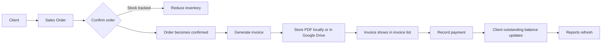

# Provisions ERP Overview and User Flow

This document summarizes the current app structure, the main working flow, and a UX/UI review based on the code in `frontend/` and `backend/`.

## What The App Does

Provisions ERP is a lightweight operations system for:

- Managing clients and their credit exposure
- Maintaining inventory with optional stock tracking
- Creating sales orders and confirming stock movement
- Generating invoices from confirmed orders
- Recording payments and tracking outstanding balances
- Building reports for sales, inventory, payments, and overdue accounts
- Generating and managing promotion/offer recommendations
- Configuring company details, logo, taxes, and PDF storage

## App Structure

### Frontend Shell

- The main route shell lives in `frontend/src/App.jsx`.
- `frontend/src/layouts/AppLayout.jsx` provides the shared app wrapper.
- Desktop navigation is a left sidebar from `frontend/src/ui/Sidebar.jsx`.
- Mobile navigation is a slide-over menu built into `AppLayout`.
- Most screens use `frontend/src/ui/TopNavbar.jsx`, `frontend/src/ui/DataTable.jsx`, `frontend/src/ui/StatusPill.jsx`, and `frontend/src/components/Modal.jsx`.

### Route Map

| Route | Screen | Purpose |
| --- | --- | --- |
| `/dashboard` | Dashboard | Overview metrics, sales chart, invoice status, recent orders/invoices |
| `/clients` | Clients | Search, create, edit, and deactivate clients |
| `/inventory` | Inventory | Search items, filter low stock, edit items, adjust stock |
| `/sales` | Sales Orders | Browse orders, filter by status, confirm drafts |
| `/sales/new` | Sales Order Form | Create a new sales order |
| `/sales/:id` | Sales Order Detail | Review order, confirm, and generate invoice |
| `/sales/:id/edit` | Sales Order Form | Edit draft orders |
| `/taxes` | Tax Rules | Manage tax rules and default tax behavior |
| `/invoices` | Invoices | Browse invoices, filter, and open PDF |
| `/invoices/:id` | Invoice Detail | View invoice and record payments |
| `/reports` | Reports | Sales, outstanding, inventory, and payments reports |
| `/offers` | Offer Recommendations | Analyze clients and manage active offers |
| `/offers/simulator` | Profit Simulator | Test offer economics before saving |
| `/settings` | Settings | Company info, logo, and Google Drive PDF storage |

## Core Data Objects

The product revolves around these entities:

- `Client`
- `Item`
- `TaxRule`
- `SalesOrder`
- `OrderItem`
- `Invoice`
- `Payment`
- `CompanySettings`
- `ClientOfferRecommendation`
- `OfferSimulation`

## End-To-End Working Flow

### 1) Sales Creation Flow

1. User starts on the dashboard or opens `Sales`.
2. User creates a new order from:
   - `Sales Orders > New Order`
   - Dashboard `+ Quick New Order`
3. User selects or creates a client.
4. User adds one or more items.
5. User can override unit price and tax per line.
6. User optionally adds an extra charge and label.
7. User saves the draft order.
8. Draft order remains editable until it is confirmed.

### 2) Confirmation Flow

1. User opens the order detail page.
2. If order status is `draft`, user can confirm it.
3. Backend checks stock for tracked items.
4. If stock is sufficient, stock is reduced and the order becomes `confirmed`.
5. If stock is insufficient, confirmation stops with an error.

### 3) Invoicing Flow

1. A confirmed order can generate an invoice.
2. User chooses due date and optional notes.
3. Backend creates invoice number, builds PDF, and stores it:
   - locally in the database, or
   - in Google Drive if connected
4. Order status changes to `invoiced`.
5. Client outstanding balance increases by the invoice amount.
6. Invoice appears in the invoices list and detail page.

### 4) Payment Flow

1. User opens an invoice detail page.
2. User records a payment with amount, method, date, and notes.
3. Backend validates amount and method.
4. Invoice amount paid increases.
5. Status changes to:
   - `partially_paid` when some balance remains
   - `paid` when fully settled
6. Client outstanding balance decreases.

### 5) Inventory Flow

1. User creates or edits an item.
2. User chooses whether the item is stock-tracked.
3. If tracked, item has quantity and reorder level.
4. Low-stock items are visible in inventory and dashboard reporting.
5. Users can manually adjust stock with a reason.

### 6) Offers Flow

1. User selects a client in `Offers`.
2. App analyzes the client using purchase history and patterns.
3. Backend generates personalized recommendations.
4. User can approve or reject offers.
5. Approved offers move into the active offers list.
6. The profit simulator can test offer economics before saving.

### 7) Reporting Flow

The reports page gives four views:

- Sales
- Outstanding
- Inventory
- Payments

These views are read-only and designed for review/printing.

## UX / UI Review

### What Is Working Well

- The app uses a clear business hierarchy: dashboard, operational lists, detail pages, and settings.
- Tables are information-dense without feeling overly heavy.
- Status pills make state changes easy to scan.
- Modal-based workflows reduce page switching for create/edit actions.
- The mobile menu and desktop sidebar give the app a usable responsive shell.
- Dashboard CTAs are action-oriented and point directly into the core flow.
- The sales and invoice path is well connected and feels operationally coherent.

### Visual System Notes

- The visual language leans clean and soft: rounded cards, muted borders, subtle shadows, and emerald brand accents.
- `ui-page`, `ui-card`, `ui-btn-primary`, and `StatusPill` create a recognizable system.
- Search selects, tables, and empty states follow a consistent pattern across most modules.

### UX Friction / Inconsistencies

- Not every page uses the same shell pattern.
  - `Dashboard`, `Clients`, `Sales`, `Offers`, and `Settings` use `TopNavbar`.
  - `Inventory`, `Invoices`, `Reports`, and `TaxRules` use custom headers.
  - This makes the app feel slightly fragmented.
- Button styling is not fully unified.
  - Some screens use `ui-btn-primary`.
  - Others use local Tailwind classes or older styles.
- Layout spacing varies between pages.
  - Some screens use `ui-page`.
  - Others use ad hoc `p-6` and custom headers.
- The quick order modal is very powerful, but long.
  - It is fast for experts.
  - It may feel dense for first-time users.
- The invoices page exposes search UI but search is not implemented yet.
- There is no obvious login or auth entry screen in the current UI, even though the HTTP layer supports a JWT header.
- A few strings show encoding artifacts in the source, which may be visible in the UI and should be cleaned up.

### Designer Takeaway

The product already has a strong operations-first backbone. The biggest UX opportunity is not a total redesign, but a tighter design system:

- unify page headers
- standardize primary/secondary actions
- tighten empty-state and error-state messaging
- simplify the quick-order path for novice users
- make the sales-to-invoice-to-payment journey feel like one continuous workflow

## Screen-Level Flow Summary

- `Dashboard`: snapshot of performance, recent activity, and quick order creation
- `Clients`: maintain customer records and credit data
- `Inventory`: maintain sellable items and stock state
- `Sales Orders`: manage order lifecycle from draft to confirmed
- `Sales Order Detail`: inspect order, confirm it, and launch invoicing
- `Invoices`: monitor billing status and export PDFs
- `Invoice Detail`: track receipts and balance due
- `Reports`: review operational metrics and print results
- `Offers`: generate and approve promotional recommendations
- `Settings`: configure company identity and PDF storage

## Backend Flow Mapping

- `backend/main.py` wires the FastAPI app and registers routers.
- `backend/routers/clients.py` handles client CRUD and deactivation.
- `backend/routers/inventory.py` handles item CRUD, stock filtering, stock adjustment, and deactivation.
- `backend/routers/sales.py` handles order creation, editing, confirmation, extra charges, and line tax overrides.
- `backend/routers/invoices.py` handles invoice generation, PDF retrieval, and payments.
- `backend/routers/reports.py` aggregates dashboard and report data.
- `backend/routers/offers.py` generates client offers and runs simulations.
- `backend/routers/settings.py` stores company settings, logo upload, and Drive auth.
- `backend/routers/taxes.py` manages tax rules and default tax behavior.

## Practical User Journey

If you want to think about the app as one continuous story:

1. Maintain the client.
2. Maintain the catalog and tax rules.
3. Create a sales order.
4. Confirm it once the stock check passes.
5. Generate an invoice.
6. Record incoming payments.
7. Watch dashboard metrics and reports update.
8. Optionally generate offers and simulate their profit impact.

